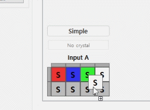
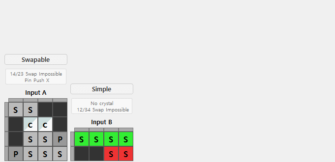
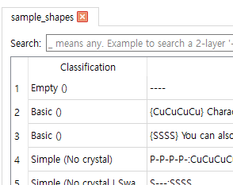
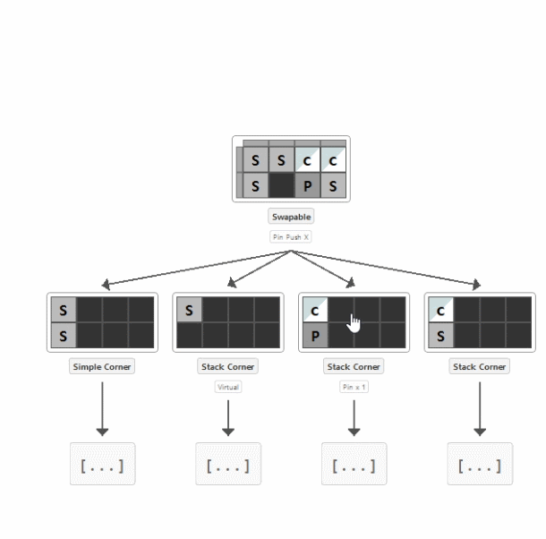

# Shapez2Analyzer


## 📺 Tutorial Video

[](https://www.youtube.com/watch?v=Bs5tuStF8Wc)

*Click the image above to watch the tutorial video*

## 🎬 Demo GIFs

### Shape Visualise and modify



### Shape Operations



### Shape Search (Support Regex)



### Process Tree Visualization



And more ...

## Installation

### For Users (Recommended)

*Download* the latest release from: [Download](https://github.com/airtnqls/Shapez2-Analytics-tools/releases/)

Simply download the zip file, extract it, and run `Shapez2Analyzer.exe`.

### For Developers

```bash
pip install -r requirements.txt
```

## Run

```bash
python gui.py
```

## Build

```bash
build.bat
```

## ⚠️ Warning

> This program and source code may contain strong spoilers.

## Features

- **Shape Simulation**: Shape Code input, Operations, Analysis and Visualisation
- **Inverse Operations**: Find original shapes from target shapes
- **Shape Classification**: Automatic shape type detection
- **Process Tree**: Visualize shape creation process
- **Batch Processing**: Handle large amounts of shape data

## TODO

- ~~**Process Tree**: Implement process tree visualization~~
- ~~**Claw Hybrid**: Implement claw and hybrid shape analysis~~
- Corner tracer with Color/(CRSW)
- ~~Writing program user documentation(Video guide)~~
- Scaling beyond 6 floors
- Expand quadrants like hexmode
- Fixing bugs
- Optimisation and refactoring

## Issues

- The logic is messy.
- Claw Hybrid / Complex Hybrid / Claw Complex Hybrid are not distinguished well.
  (Because the hybrid logic solve some of the claw hybrid logic.)
- Classification of shapes is being called recursively.
- Unused py files are left.

## Project Structure

```
Shapez2/
├── gui.py                 # Main GUI application
├── shape.py               # Core shape classes and operations
├── shape_classifier.py    # Shape classification system
├── process_tree_solver.py # Process tree generation
├── corner_tracer.py       # Corner tracing algorithm
├── hybrid_tracer.py       # Hybrid shape tracing algorithm
├── claw_tracer.py         # Claw tracing algorithm
├── claw_hybrid_tracer.py  # Claw hybrid tracing algorithm
├── data_operations.py     # Data processing utilities
├── data/                  # Data files directory
├── icons/                 # Application icons
├── locales/               # Internationalization files
├── docs/                  # Documentation
```
