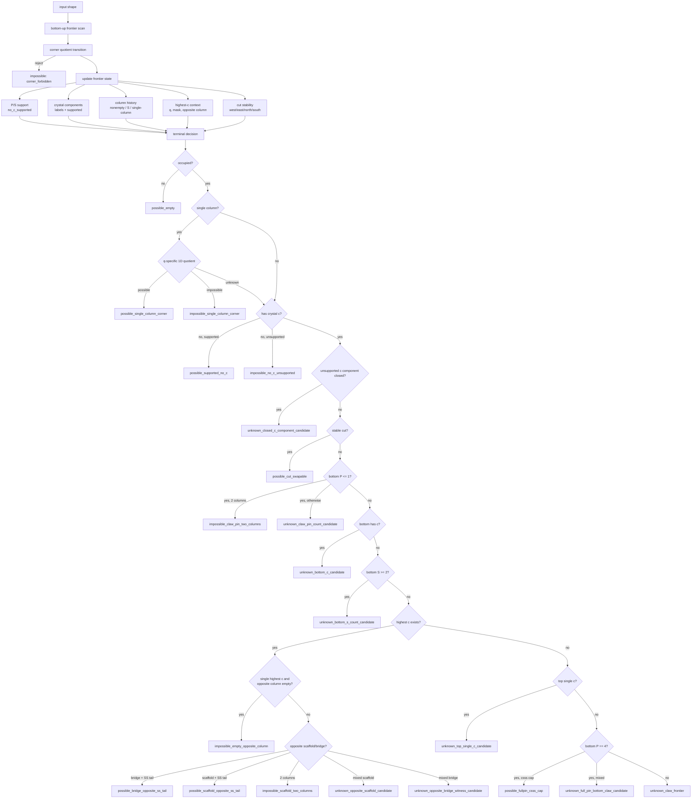

# Symbolic Frontier Automaton, Depth 5

This document summarizes the current automaton in `scripts/symbolic_frontier_automaton.py`.
The goal is not to replay the full legacy search, but to scan the shape bottom-up into a finite frontier state and classify terminal states as `possible`, `impossible`, or `unknown`.

## State Elements

- `corner_state_ids`: quotient state of the existing 1D corner automaton for the four rotations.
- `no_c_supported`: physical support check for shapes without crystal `c`.
- `c_component_labels`, `c_component_supported`: frontier partition of active crystal components and whether each component is supported from below.
- `c_closed_unsupported`: an unsupported crystal component disappeared from the frontier.
- `column_nonempty_seen`: whether each quadrant column has ever been occupied.
- `column_s_seen`: whether each quadrant column has ever contained `S`.
- `highest_c_q`, `highest_c_mask`, `highest_c_layer_nonempty_mask`: position and layer context of the highest crystal layer.
- `opposite_col_kind`: relation between a highest crystal and its opposite column.
- `cut_stable_sides`: whether west/east/north/south halves remain independently stable.
- `prev_s_mask`, `top_s_mask`, `prev_c_mask`, `top_c_mask`: masks for the top two scanned layers.
- `single_column_q`, `single_column_code`: exact 1D column state when the whole shape occupies only one quadrant.

## Terminal Nodes

### Possible

- `possible_empty`: no occupied cell.
- `possible_supported_no_c`: no crystal exists and every P/S layer is physically supported.
- `possible_cut_swapable`: at least two columns are used, and either the vertical or horizontal split has both halves stable.
- `possible_bridge_opposite_ss_tail`: opposite-column bridge witness with bottom `PPPP`, top two opposite cells both `S`, and a `c + SSS` bridge layer.
- `possible_scaffold_opposite_ss_tail`: scaffold witness with bottom `PPPP`, top two opposite cells both `S`, and the top layer exactly `1c + 2S + 1 empty`.
- `possible_fullpin_csss_cap`: full-pin bucket with bottom `PPPP`, previous layer exactly one `c`, and top layer exactly `1c + 3S`.
- `possible_single_column_corner`: q-specific 1D terminal quotient says the one-column shape is possible.

### Impossible

- `corner_forbidden`: the embedded corner automaton rejects during transition.
- `impossible_no_c_unsupported`: no crystal exists, but P/S physical support fails.
- `impossible_empty_opposite_column`: the highest crystal layer has exactly one `c`, and the opposite column has never been occupied.
- `impossible_single_column_corner`: q-specific 1D terminal quotient says the one-column shape is impossible. Virtual Corner is strict impossible.
- `impossible_claw_pin_two_columns`: claw-pin candidate where the whole prefix used exactly two non-empty columns.
- `impossible_scaffold_two_columns`: opposite-scaffold candidate where the whole prefix used exactly two non-empty columns.

### Unknown

- `unknown_claw_pin_count_candidate`
- `unknown_bottom_c_candidate`
- `unknown_bottom_s_count_candidate`
- `unknown_closed_c_component_candidate`
- `unknown_opposite_scaffold_candidate`
- `unknown_opposite_bridge_witness_candidate`
- `unknown_top_single_c_candidate`
- `unknown_full_pin_bottom_claw_candidate`
- `unknown_claw_frontier`
- `layers_exceeded` when evaluating data deeper than the configured depth.

## Flow Graph



## Current Checks

File-wise shuffled `/data` sample:

```powershell
python scripts\symbolic_frontier_automaton.py --depth 5 --corner-mode quotient --eval-data data --eval-per-file 200 --eval-limit 5000 --seed 123 --max-mismatches 8
```

```text
eval_total=3340
eval_non_unknown=1439
strict_match=1439
strict_precision=100.000000%
virtual_legacy_possible=8
```

`data/claw_stack_test`:

```powershell
python scripts\symbolic_frontier_automaton.py --depth 5 --corner-mode quotient --eval-data data\claw_stack_test --eval-per-file 500 --eval-limit 5000 --seed 123 --max-mismatches 8
```

```text
eval_total=1887
eval_non_unknown=270
strict_match=270
strict_precision=100.000000%
```

Uniform random depth 5:

```powershell
python scripts\symbolic_frontier_automaton.py --depth 5 --corner-mode quotient --eval-random 50000 --eval-limit 50000 --eval-random-layers 5 --seed 787 --max-mismatches 8
```

```text
eval_total=50000
eval_non_unknown=48313
strict_match=48313
strict_precision=100.000000%
```

## Current Bottleneck

The largest unresolved `/data` buckets are mixed, not pure:

- `unknown_opposite_scaffold_candidate`: 367 strict possible, 363 strict impossible.
- `unknown_claw_frontier`: 155 strict possible, 530 strict impossible.
- `unknown_full_pin_bottom_claw_candidate`: 175 strict possible, 142 strict impossible.

Because these buckets are mixed, the next improvement needs a new state refinement rather than promoting the whole bucket.
